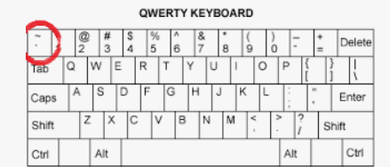
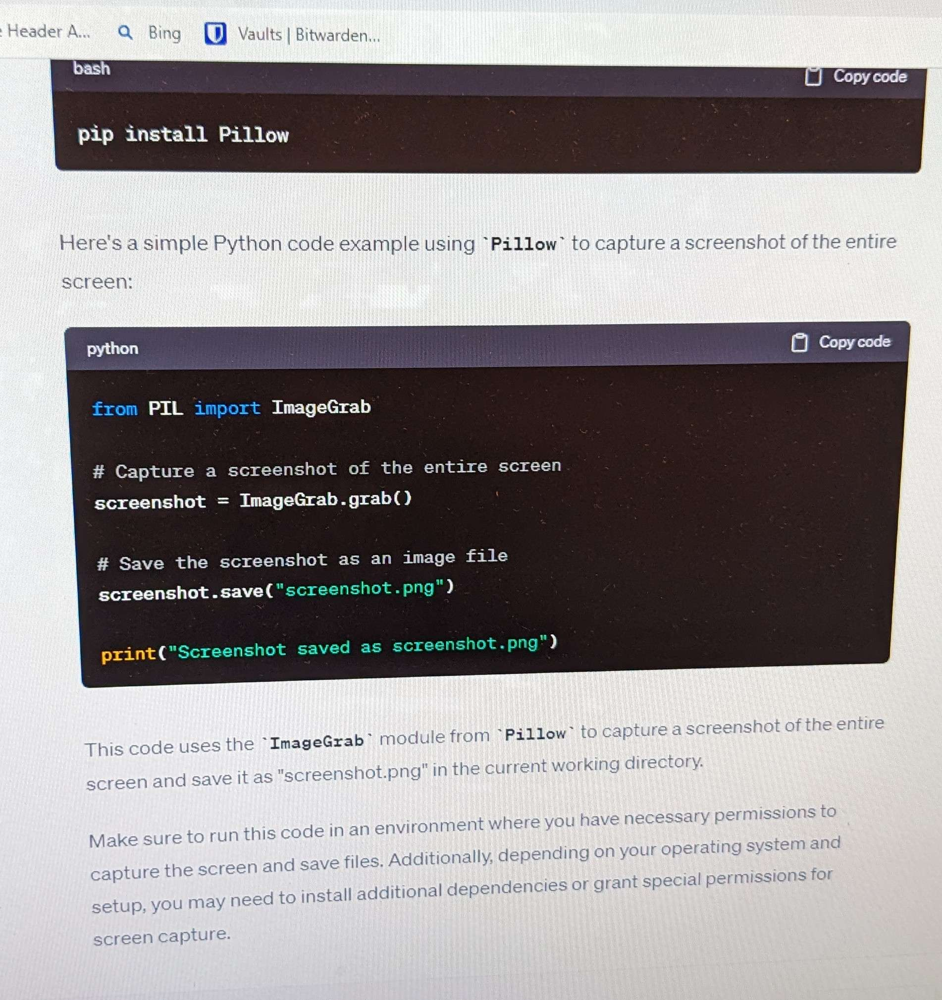
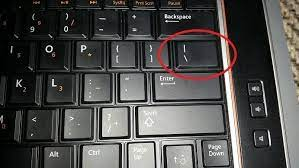

# Writing Good Documentation

## Step 1 - Using Codeblocks

Codeblocks in mardown make it *very easy* for tech people to **copy, paste, share** code.
A good __Cloud Engineer__ uses Codeblocks whenever possible.

Because it allows others to copy and paste their code to replicate or research issues.

- In order to creat codeblocks in markdown you need to use 3 backticks"`"
- Not to be confused with single quotes "'"

```
def factorial(n)
  if n == 0
    return 1
  else
    return n * factorial(n - 1)
  end
end

# Calculate and print the factorial of 5
result = factorial(5)
puts "Factorial of 5 is #{result}"
```

- When you should attempt to apply syntax highlighting to your codeblocks

 ```ruby
def factorial(n)
  if n == 0
    return 1
  else
    return n * factorial(n - 1)
  end
end

# Calculate and print the factorial of 5
result = factorial(5)
puts "Factorial of 5 is #{result}"
```

- Image of the backtick on a keyboard
  



- Good cloud Engineers use codeblocks for both Code and Errors that appear in the console.

```bash
test.rb:2:in `raise_error': This is a custom error message (RuntimeError)
	from test.rb:5:in `<main>'
```
> Here is an example of using a codeblock for an error that appears in bash.

## Step 2 - How to take screenshots

A screenshot is when you capture a part of your screen from your laptop desktop or phone.

This is not to be confused with taking a photo with your phone.

## DON'T DO THIS#



## DO THIS INSTEAD#

In Windows and macOS, you can use keyboard shortcuts or hotkeys to capture screenshots without the need for additional software. Here are some common screenshot shortcuts for both operating systems:

**Windows:**

1. **PrtScn (Print Screen) key:** Pressing the "PrtScn" key captures the entire screen and copies it to your clipboard. You can then paste it into an image editing program like Paint or Microsoft Word and save it as an image.

2. **Alt + PrtScn:** Captures only the currently active window and copies it to the clipboard.

3. **Windows + Shift + S (Windows 10 and later):** Opens the Snip & Sketch tool, which allows you to select a portion of the screen to capture.

**macOS:**

1. **Shift + Command + 3:** Captures the entire screen and saves it as a file on your desktop.

2. **Shift + Command + 4:** Turns the cursor into a crosshair, allowing you to select a specific area of the screen to capture. After selecting the area, it will be saved as a file on your desktop.

3. **Shift + Command + 4, then Spacebar:** After pressing Shift + Command + 4, you can press the spacebar to capture a specific window or dialog box. Click on the window you want to capture, and it will be saved as a file on your desktop.

4. **Shift + Command + 5 (macOS Mojave and later):** Opens the Screenshot app, which provides additional options for capturing screenshots and recording the screen.


## Step 3 - use Gethub flavored mardown Task Lists

github extednds markdown to have a list where you can check off items. [<sup>[1]</sup>](#externel-references)

- [x] Finish Step 1
- [ ] Finish Step 2
- [x] Finish Step 3


## Step 4 - Use Emojis (Optional)

Github Flavored Markdown (GFM) supports emoji shortcodes
| Name | Shortcode | Emoji |
| --- | --- | --- |
| cloud | `:cloud:` | :cloud: |
| cloud with lightning | `:cloud_with_lightning:` | :cloud_with_lightning: |


## Step 5 - How to create a table

You can use the following Mardown format to create tables
```md
| Name | Shortcode | Emoji |
| --- | --- | --- |
| cloud | `:cloud:` | :cloud: |
| cloud with lightning | `:cloud_with_lightning:` | :cloud_with_lightning |
```
Github extends the functioality of Mardown tables to provide more alignment and table cell formatting options [<sup>[2]</sup>](#externel-references)

- Image of pipe character on keyboard



  ##   Externel References
  
  - [Basic writing and formatting syntax](https://docs.github.com/en/get-started/writing-on-github/getting-started-with-writing-and-formatting-on-github/basic-writing-and-formatting-syntax#images)
  - [GFM - Task Lists](https://docs.github.com/en/get-started/writing-on-github/getting-started-with-writing-and-formatting-on-github/basic-writing-and-formatting-syntax#task-lists) <sup>[1]</sup>
  - [GFM - Emoji CheatSheet](https://github.com/ikatyang/emoji-cheat-sheet)
  - [GFM - Tables](https://github.github.com/gfm/#tables-extension-) <sup>[2]</sup>


